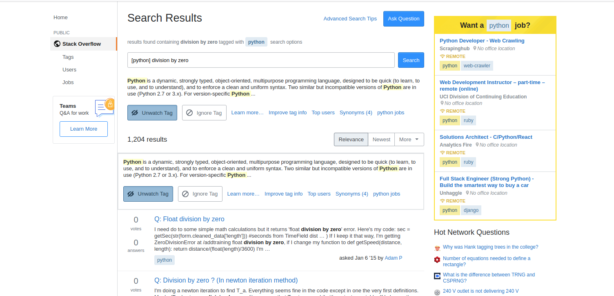

# PySpecty
Most of time developers spend on stackoverflow searching for their python errors, this library automatically search for solution on stackoverflow as soon as you get an python error and save a lot of time from  a loop of reading error, searching it on stackoverflow.

## Installation

Installation is simplest with pip:

    pip install pyspecty
    

#### Installation notes

pyspecty depends on `singleton-decorator` only.

pyspecty automatically search python errors on stackoverflow. See [Usage](#usage) below.

## Usage

Check out [A simple usage example](Example/main.py) for a short intro. A sample usage is:

```python
from pyspecty import PySpecty
PySpecty() # that's it!
```

From [example](Example/main.py):
```python
from pyspecty import PySpecty

PySpecty() # That's it!! Do it somewhere in your file

# The actual code!!

print(2/0)

# Code end here

```

output is:



## TODO

1. Tests need to be written.
2. A dumb page also open that need to be fixed.

## Contributing

Feel free to submit pull requests to me.

## Authors

* **Muhammad Haseeb** - *Initial work* - [Muhammad Haseeb](https://github.com/iam-mhaseeb)

## Licensing
The pycloudy library is [MIT Licenced](LICENSE). Feel free to use commercially of personally.
